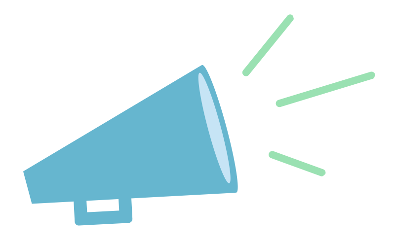
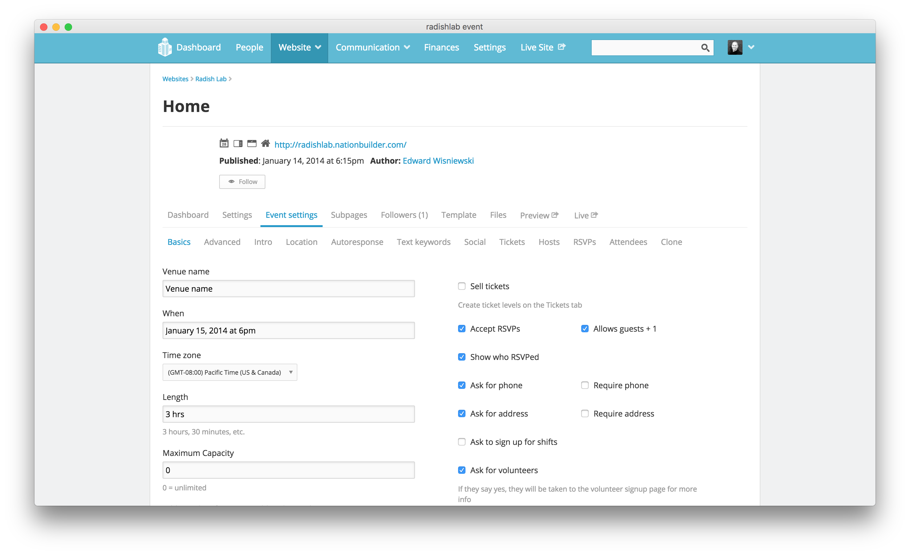
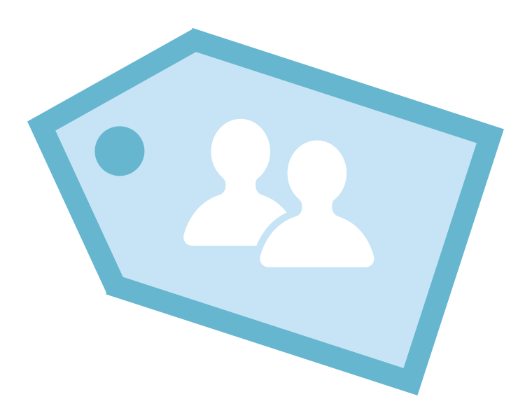



## People

{: .center-container}

Now, I’m going to cover how NationBuilder keeps track of users on your site and how you can communicate with those users. This is a big part of the power behind the NationBuilder platform which simplifies this connection in some really useful ways.

Let’s begin in the People section. This is where any user that interacts with your site is stored and accessed. All people are essentially on a single list and filtered with tags and such. When a user fills out a form for the first time, NationBuilder will create a record in the People section with the data routed to their corresponding fields.

As an example, this is the template of a default join page:



  <label for="signup_first_name">First Name</label>
  

  <label for="signup_email">Email</label>
  



The first liquid call, <code></code>, is going to populate the **First Name** field in the people section. But the actual page will render the normal form HTML.

So...



becomes:

<input class="text" id="signup_first_name" name="signup[first_name]" type="text" />

And the email field renders similarly:



which becomes:

<input class="text" id="signup_email" name="signup[email]" type="email" />

The first attribute (**text_field** and **email_field**) defines the input type, and the class field allows you to pass classes through to the HTML tag. The ID and name are automatically generated because they change depending on the page type (**signup**, **petition**, **event RSVP**, etc.) in question.

{: .full-width}

## Tagging

{: .center-container}

A tag can be added automatically to a person when they take an action on your website or contact a broadcaster. These tags sort people in your database based on a particular action they took. So anyone who signs a particular petition, for example, would then have that tag.

If you want to add, edit, merge, or generally clean up these people tags, go to **People > Tags > View all**.

Once there, any existing tag within your system can also be added to a person manually by going to **People** and then clicking the add tag button right from a person's profile preview.

To add a tag to a list of people, you would do a [batch update](http://nationbuilder.com/how_to_batch){:target="_blank"}.

You can also [filter people by tag](http://nationbuilder.com/how_to_filter){:target="_blank"} in order to target any tag combination. That's how you can build a recipient list for an email blast that targets, for example, anyone who has ever signed a petition or anyone who has signed _both_ petition A and petition B, etc. Once you build a filter this way, you can save it and then use it to send out an [email blast](http://nationbuilder.com/how_to_create_an_email_blast){:target="_blank"}.

## Communication

People in the NationBuilder database are either Supporters, Prospects, or Non-Supporters.

*   **A Supporter** has explicitly opted into receiving bulk communications (email blasts, sms blasts).
*   **A Non-Supporter** has explicitly opted out of receiving bulk communications.
*   **A Prospect** has neither opted into nor out of bulk communications, but is in your database for some reason (tweeted at you, emailed a broadcaster, voter file import, etc.)

NationBuilder restricts users from being able to send out email blasts to prospects and non-supporters, and will automatically remove those profiles from the recipient list if they’re on it. When a user signs up for a email blast, really what they’re doing is:

1.  Opting into email support and becoming a "supporter" of the nation
2.  Assigning a tag to themselves that is used to send mailings via. For example, there exist tags like **Weekly Newsletter tag**, **Monthly Newsletter tag**, etc. and when an email blast is sent, the recipient list is set to **users tagged with Weekly Newsletter**.

More on formatting and controlling email blasts [here](http://nationbuilder.com/how_to_create_an_email_blast){:target="_blank"}.

You can also assign a tag to be used as a subscription option, so that "unsubscribing" actually becomes removing the tag from that profile. Full details [here](http://nationbuilder.com/how_to_use_the_unsubscribe_page){:target="_blank"}.

And lastly, say _you_ want to be notified whenever someone takes an action on a page. First, make sure whatever email address you want to use is set up as an admin user. To do this, log in with that email address and go to **Settings > Your account > Email notifications** and check the box next to whichever action you wish to trigger an email. The column refers to who would trigger that email. Instructions are [here](http://nationbuilder.com/notification_emails#adjust).

And that’s a basic introduction to communicating with your users on NationBuilder. The next level of engagement would be [paths](http://nationbuilder.com/create_paths){:target="_blank"} which is NationBuilder’s way of allowing you to keep users on track toward a specific goal.

Check back for my last installment in this series on memberships, signups, and actions. Until then!
